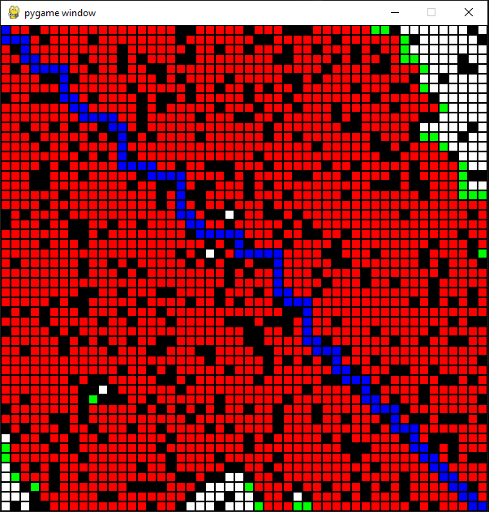

# python-a-star-visualization
A visualization of the A* pathfinding algorithm. Run the program by invoking the python command
on "a_star.py". The program searches for the most optimal path from the top left cell to 
the bottom right cell. 

A screenshot of the program after completing the algorithm can be seen below.

    

Any feedback or suggestions would be much appreciated.